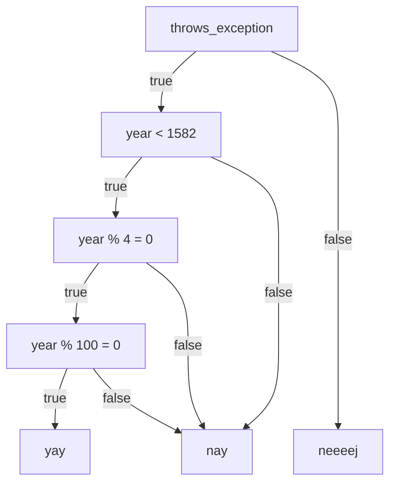

# w01
## IsLeapYear diagram

```mermaid
flowchart TD
A[throws_exception] -->|true| B
A[throws_exception] ----->|false|G
B[year < 1582] -->|true|C
B[year < 1582] -->|false|H
C[year % 4 = 0] -->|true|E
C[year % 4 = 0] -->|false|H
E[year % 100 = 0] --> |true|F
E[year % 100 = 0] --> |false|H
F["yay"]
G["neeeej"]
H["nay"]
```